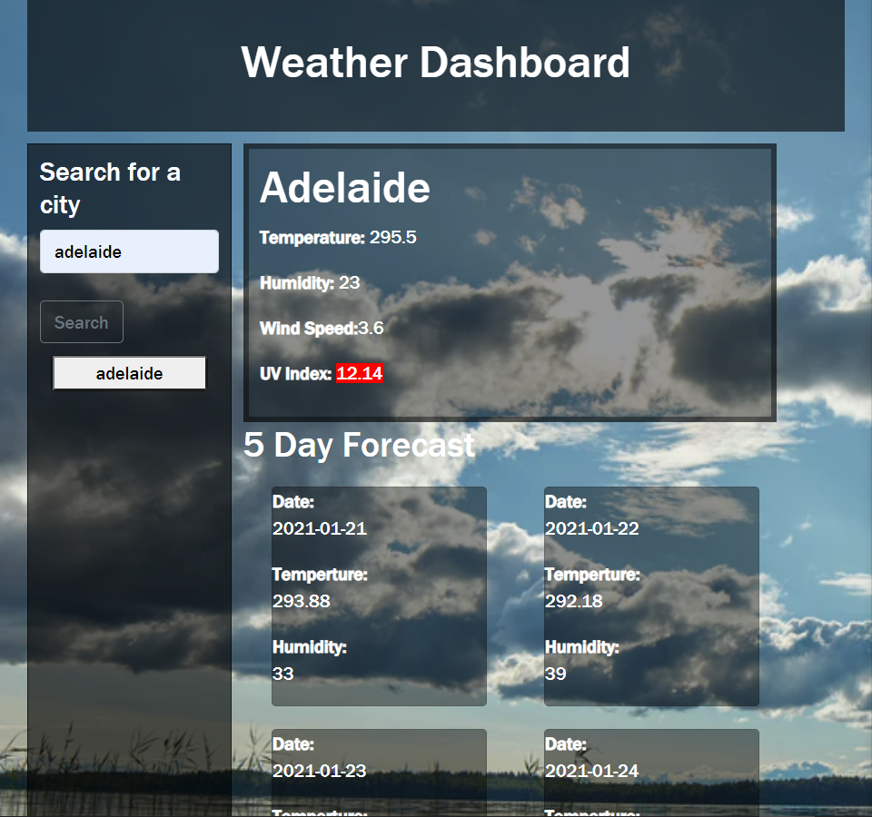

#  Weather Dashboard

## User Story

```
For the user like to travel around
This website able to tell them about the real time weather of the location they search for and also the 5 day forecast.
```

##  Website



## Funtion

* search for city, get the api source from the open weather map
```js
    function displayCity(event) {
            event.preventDefault();
            $("#current-weather").empty();
            $("#5dayForecast").empty();
            $("#dayForecastTitle").empty();
            var city = $("#add-city").val();
            var queryURL = "https://api.openweathermap.org/data/2.5/weather?q=" + city + "&appid=add980b0e4dcc7dac5f789a39df8c020";
            $.ajax({
                url: queryURL,
                method: "GET"
            }).then(function (response) {
                searchHistory.push(city);
 ```

* Get information from the api response

```js
 $("#current-weather").append("<h1>" + response.name + "</h1>");
                
                renderResult(response);
                renderUV(response.coord.lat, response.coord.lon);
                weatherForecast(city);
```
* Classify the level of UV index by using if statement 

```js
if (parseInt(response.value) <= 5) {
                    $("#uv").css("backgroundColor", "green");
                }
                else if (parseInt(response.value) <= 10) {
                    $("#uv").css("backgroundColor", "yellow");
                }
                else {
                    $("#uv").css("backgroundColor", "red");
```


* Forecast the weather with get info from forecsting api

```js
 var queryURL = "http://api.openweathermap.org/data/2.5/forecast?q=" + city + "&appid=add980b0e4dcc7dac5f789a39df8c020";
            $.ajax({
                url: queryURL,
                method: "GET"
            }).then(function (response) {
                console.log(response);
                $("#dayForecastTitle").append("<h2>" + "5 Day Forecast" + "</h2>" + "<br>");
                for (var i = 0; i < response.list.length; i += 8) {
                    var col = $("<div class = 'col-lg-4 col-sm-6'>");

                        // style='width: 25rem; margin:5px'
                    var div = $("<div class='card' >");
                    var date = filter(response.list[i].dt_txt);
                    console.log(date);
                    div.append("<p >"+"<strong>Date:</strong>" + "<br>"+date + "</p>");
                    div.append("<p>" + "<strong>Temperture:</strong>"+"<br>"+response.list[i].main.temp + "</p>");
                    div.append("<p>" + "<strong>Humidity:</strong>"+"<br>"+response.list[i].main.humidity + "</p>");
                    col.append(div)

                    $("#dayForecast").append(col);
      
```
- - -
© 2020 shelly tan 
